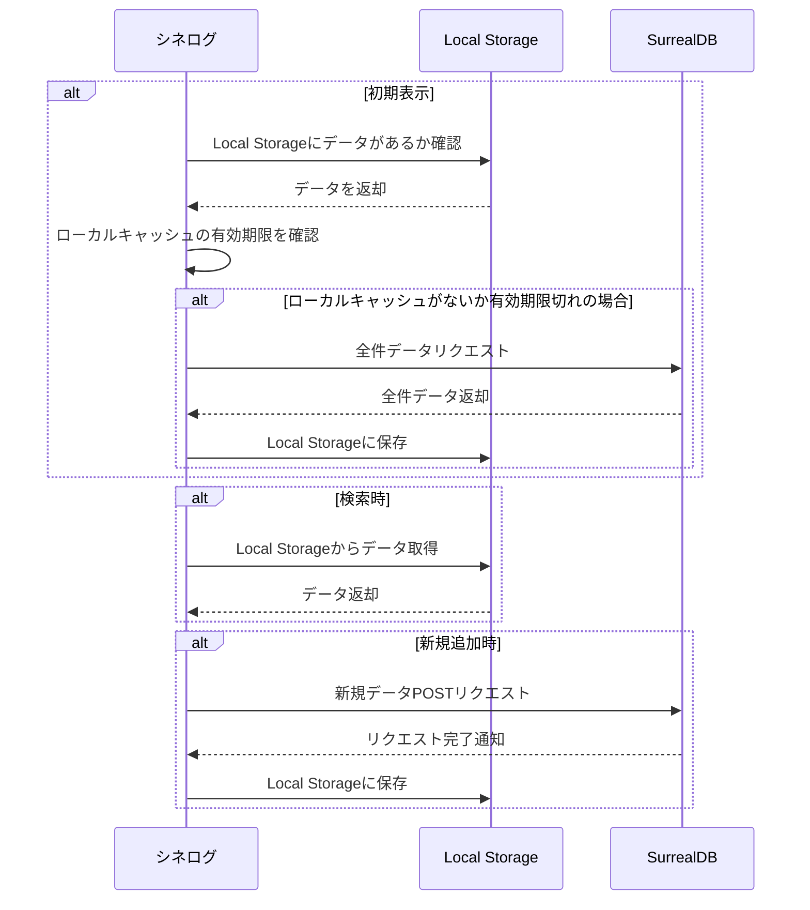
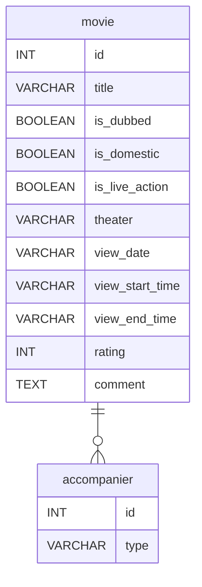

# CineLog
`CineLog === Cinema Log`  
私が映画館で今まで観た映画を載せた個人サイト。  
取得データは、自分のGoogleカレンダーに記載されていた2016年9月〜現在まで。  
データベースの準備が整うまでは`assets/test.json`を仮置きしている。

## 必要なもの
- Denoの最新版
- SurrealDBの最新版

## データ構造
### シーケンス図
理想としている流れ

### ER図
主キーはidで、`AUTO_INCREMENT`を適用。  
映画を観に行くときに同伴者がいることが稀なので、現状はmovieテーブルのみを作成し利用する

https://www.delftstack.com/ja/howto/mysql/store-array-in-mysql/

