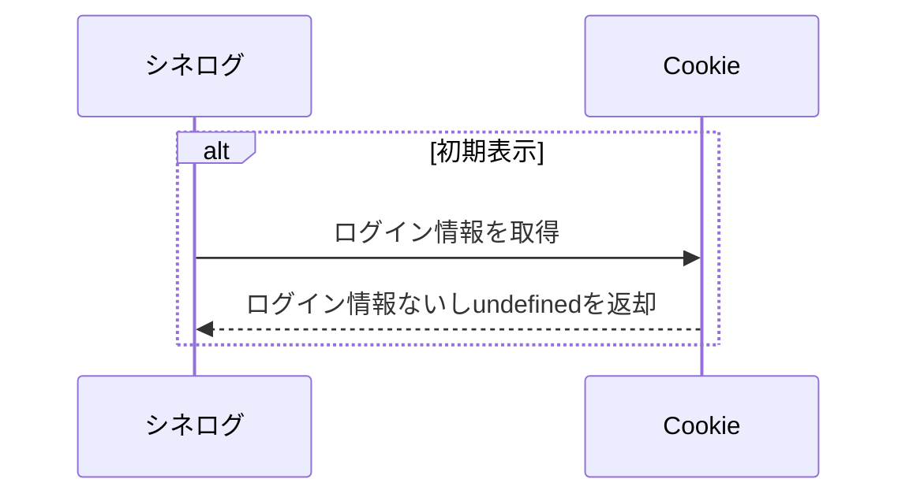
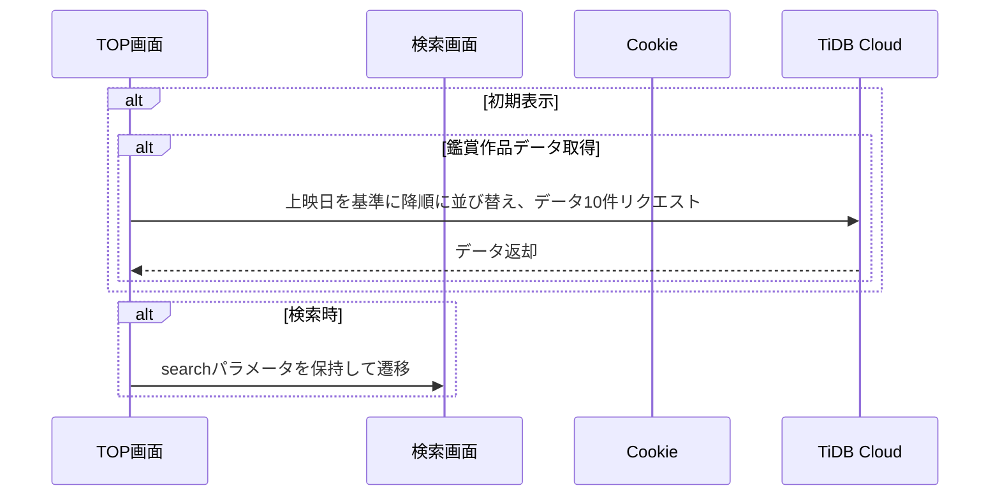
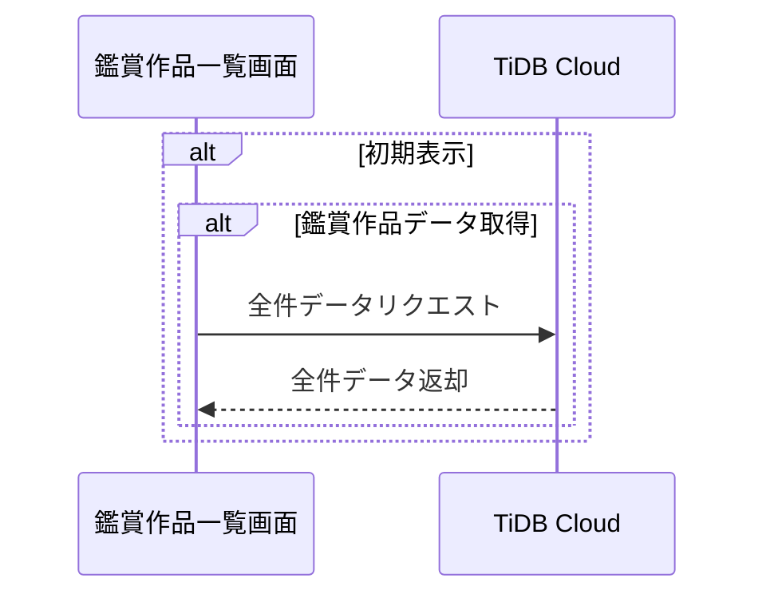
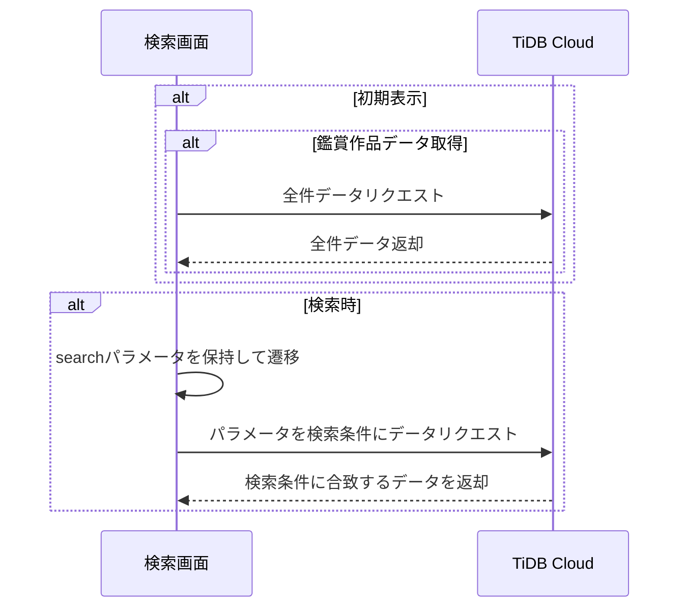
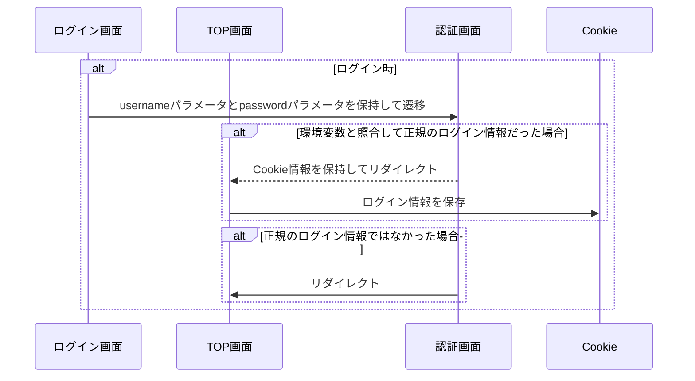
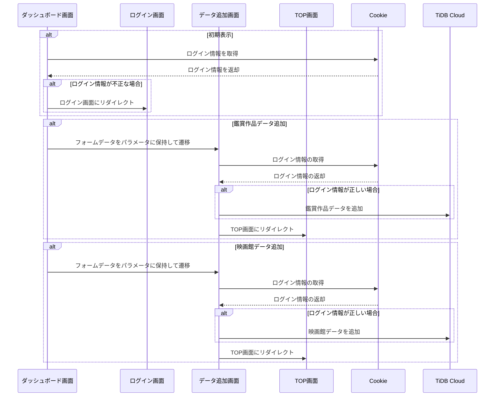

# CineLog
`CineLog === Cinema Log`  
私が映画館で今まで観た映画を載せた個人サイト。  
取得データは、自分のGoogleカレンダーに記載されていた2016年9月〜現在まで。

## 必要なもの
- Denoの最新版
- TiDB Cloudのアカウント情報

## データ構造
### シーケンス図
#### 共通ヘッダー

#### TOP画面

#### 鑑賞作品一覧画面

#### 検索画面

#### ログイン画面

#### ダッシュボード画面

