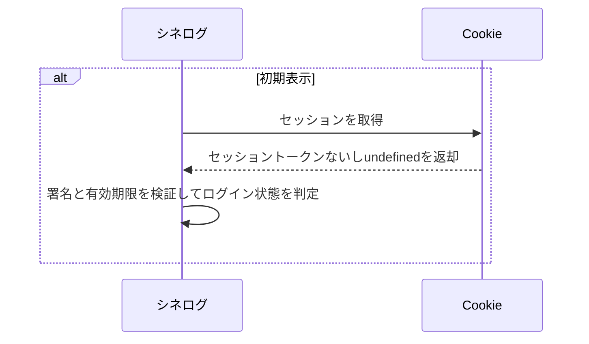
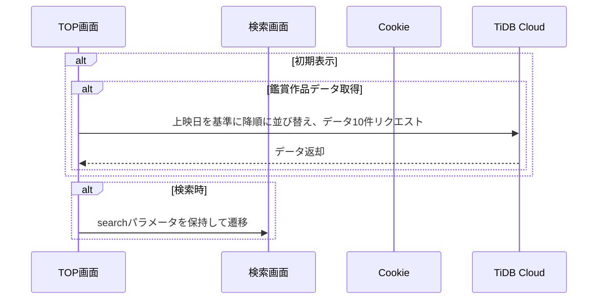
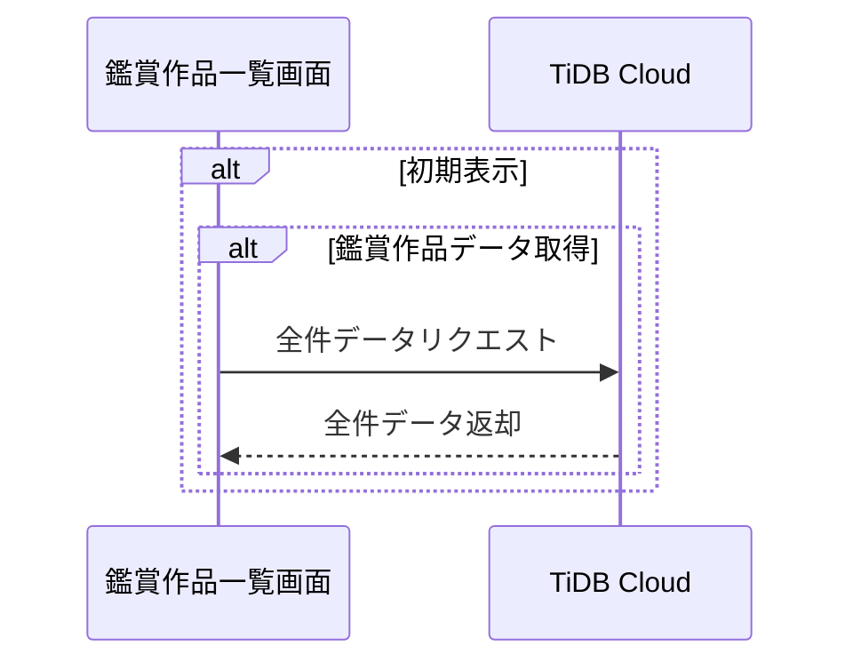
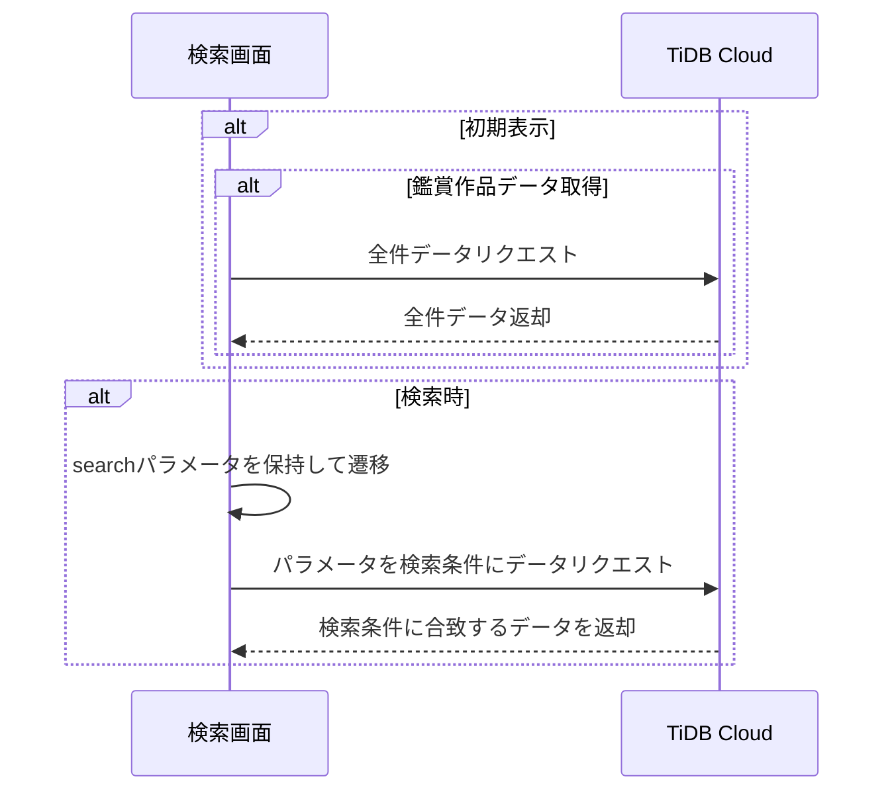
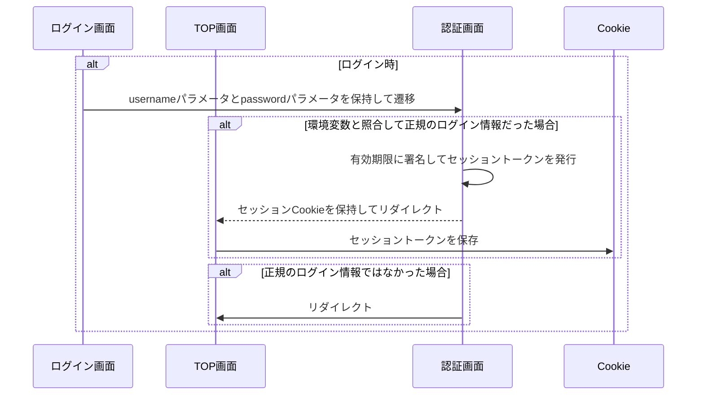
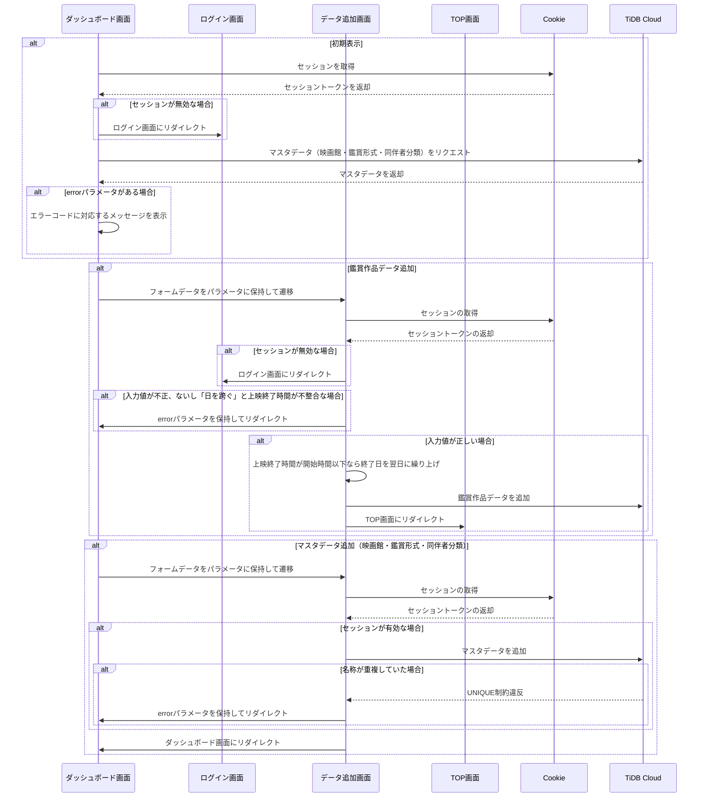

# CineLog
`CineLog === Cinema Log`  
私が映画館で今まで観た映画を載せた個人サイト。  
取得データは、自分のGoogleカレンダーに記載されていた2016年9月〜現在まで。

## 必要なもの
- Denoの最新版
- TiDB Cloudのアカウント情報

## ダッシュボードの認証
ログイン情報（`USERNAME` / `PASSWORD`）との照合はログイン時だけ行い、以降はセッションCookieで判定する。

- Cookieに載せるのは「有効期限」と「その署名」だけで、ユーザー名・パスワードは載せない
- Cookieには`HttpOnly` / `Secure` / `SameSite=Lax` / `Path=/` / `Max-Age`（30日）を付与する（`Secure`はローカル開発時を除く）
- 署名鍵は`PASSWORD`から導出しているため、パスワードを変更すると発行済みのセッションはすべて無効になる

## データ構造
### シーケンス図
#### 共通ヘッダー

``` mermaid
sequenceDiagram
  participant app as シネログ
  participant cookie as Cookie

  alt 初期表示
    app ->> cookie : セッションを取得
    cookie -->> app : セッショントークンないしundefinedを返却
    app ->> app : 署名と有効期限を検証してログイン状態を判定
  end
```

#### TOP画面

``` mermaid
sequenceDiagram
  participant toppage as TOP画面
  participant searchpage as 検索画面
  participant cookie as Cookie
  participant db as TiDB Cloud

  alt 初期表示
    alt 鑑賞作品データ取得
      toppage ->> db : 上映日を基準に降順に並び替え、データ10件リクエスト
      db -->> toppage : データ返却
    end
  end

  alt 検索時
    toppage ->> searchpage : searchパラメータを保持して遷移
  end
```

#### 鑑賞作品一覧画面

``` mermaid
sequenceDiagram
  participant app as 鑑賞作品一覧画面
  participant db as TiDB Cloud

  alt 初期表示
    alt 鑑賞作品データ取得
      app ->> db : 全件データリクエスト
      db -->> app : 全件データ返却
    end
  end
```

#### 検索画面

``` mermaid
sequenceDiagram
  participant app as 検索画面
  participant db as TiDB Cloud

  alt 初期表示
    alt 鑑賞作品データ取得
      app ->> db : 全件データリクエスト
      db -->> app : 全件データ返却
    end
  end

  alt 検索時
    app ->> app : searchパラメータを保持して遷移
    app ->> db : パラメータを検索条件にデータリクエスト
    db -->> app : 検索条件に合致するデータを返却
  end
```

#### ログイン画面

```mermaid
sequenceDiagram
  participant loginpage as ログイン画面
  participant toppage as TOP画面
  participant redirect as 認証画面
  participant cookie as Cookie

  alt ログイン時
    loginpage ->> redirect : usernameパラメータとpasswordパラメータを保持して遷移
    alt 環境変数と照合して正規のログイン情報だった場合
      redirect ->> redirect : 有効期限に署名してセッショントークンを発行
      redirect -->> toppage : セッションCookieを保持してリダイレクト
      toppage ->> cookie : セッショントークンを保存
    end
    alt 正規のログイン情報ではなかった場合 
      redirect ->> toppage : リダイレクト
    end
  end
```

#### ダッシュボード画面

```mermaid
sequenceDiagram
  participant dashboardpage as ダッシュボード画面
  participant loginpage as ログイン画面
  participant redirect as データ追加画面
  participant toppage as TOP画面
  participant cookie as Cookie
  participant db as TiDB Cloud
  
  alt 初期表示
    dashboardpage ->> cookie : セッションを取得
    cookie -->> dashboardpage : セッショントークンを返却
    alt セッションが無効な場合
      dashboardpage ->> loginpage : ログイン画面にリダイレクト
    end
    dashboardpage ->> db : マスタデータ（映画館・鑑賞形式・同伴者分類）をリクエスト
    db -->> dashboardpage : マスタデータを返却
    alt errorパラメータがある場合
      dashboardpage ->> dashboardpage : エラーコードに対応するメッセージを表示
    end
  end
  
  alt 鑑賞作品データ追加
    dashboardpage ->> redirect : フォームデータをパラメータに保持して遷移
    redirect ->> cookie : セッションの取得
    cookie -->> redirect : セッショントークンの返却
    alt セッションが無効な場合
      redirect ->> loginpage : ログイン画面にリダイレクト
    end
    alt 入力値が不正、ないし「日を跨ぐ」と上映終了時間が不整合な場合
      redirect ->> dashboardpage : errorパラメータを保持してリダイレクト
    end
    alt 入力値が正しい場合
      redirect ->> redirect : 上映終了時間が開始時間以下なら終了日を翌日に繰り上げ
      redirect ->> db : 鑑賞作品データを追加
      redirect ->> toppage : TOP画面にリダイレクト
    end
  end

  alt マスタデータ追加（映画館・鑑賞形式・同伴者分類）
    dashboardpage ->> redirect : フォームデータをパラメータに保持して遷移
    redirect ->> cookie : セッションの取得
    cookie -->> redirect : セッショントークンの返却
    alt セッションが有効な場合
      redirect ->> db : マスタデータを追加
      alt 名称が重複していた場合
        db -->> redirect : UNIQUE制約違反
        redirect ->> dashboardpage : errorパラメータを保持してリダイレクト
      end
    end
    redirect ->> dashboardpage : ダッシュボード画面にリダイレクト
  end
```
